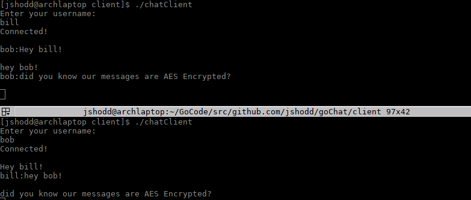
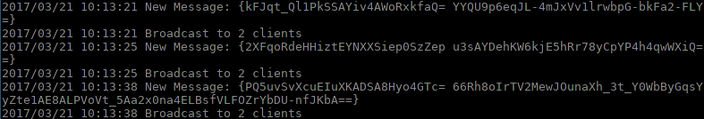

[See the latest code here](https://www.github.com/jshodd/goChat)

This project was a great learning opportunity for myself, as it was my first project in GoLang and it also gave me a chance to experiment with new concepts like concurrency, network programming, and encryption. This program utilizes Go's included concurrency to accept multiple connections independantly, this was a great way to learn about multi-processing and concurrency. To establish a connection between the server and it's clients, the server listens on a TCP port on the local host and the clients dial on that port. After the connection is made, the client sends a json object to the server that contains the user names and the message. But before that json is sent, the name and message are both encrypted, while this is not apparent by using the client, you can see the effect on the server below.  

As you can see, not even the server can see what the message includes, both the name and the message itself are AES encrypted. This means that if a malicious user were using a tool such as Wireshark, they would not be able to see the conversations.

