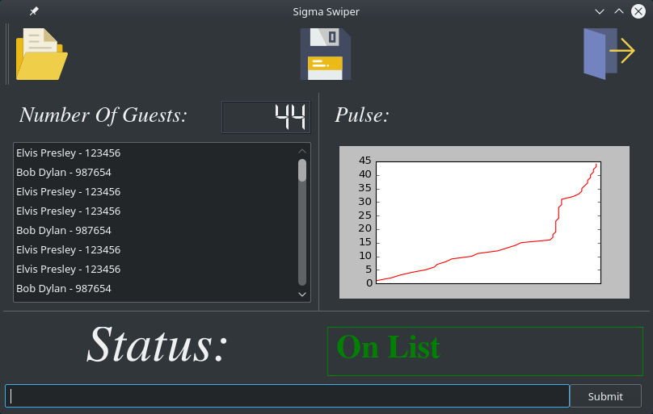

[See the latest code here](https://www.github.com/jshodd/sigmaSwiper)

I was involved in many organizations in my college career, and every single one had a similar issue. Whether it is a group holding official meetings, recruiting members, or having a social event, these organizations needed to know who all attended. These groups used to simply write all names and ID numbers by hand and physically check guestlists if applicable. My solution to this problem was to implement a program that will allow these groups to use the student ID cards to make this task trivial, along with many additional features. When building this product I focused on our on campus fraternities. For each social event that the fraternities have, they must keep an updated list of who all entered their houses as well as use guestlists to only grant certain individuals access. This would be an easy task if only twenty people attended these events, but with the average attendance being around 200 people, human error begins to take effect. To solve this problem, I built a kiosk with a [raspberry pi 3](https://www.amazon.com/Raspberry-Pi-896-8660-Model-Motherboard/dp/B01CD5VC92/ref=sr_1_1?s=pc&ie=UTF8&qid=1483812107&sr=1-1&keywords=raspberry+pi+3). While the progam works perfectly on a full sized computer, a kiosk was a much more convinient and cost effective method costing approximately $150 (a full list of parts will be listed below).

## Current Features  
* Using a USB magnetic card reader or manually enter ID number
* Automatically check entered ID against a selected guestlist
* Generate a list of all attendees with the following columns: ID, Name, Time Entered
* Show the generated list as it is created in a list view within the gui
* Show a running count of the number of guests
* Automatically email the list to a specified email address using
* Data visualization using matplotlib (live updating graph on screen, final static graph on exported list)

## Rasberry Pi Kiosk Parts
* [raspberry pi 3](https://www.amazon.com/gp/product/B01C6FFNY4/ref=oh_aui_detailpage_o00_s01?ie=UTF8&psc=1)
* [7 inch touch screen](https://www.amazon.com/gp/product/B0153R2A9I/ref=oh_aui_detailpage_o00_s01?ie=UTF8&psc=1)
* [Adjustable case](https://www.amazon.com/gp/product/B01HKWAJ6K/ref=oh_aui_detailpage_o00_s01?ie=UTF8&psc=1)
* Any Magnetic Card Reader
* [Micro SD card (16gb)](https://www.amazon.com/gp/product/B010Q57SEE/ref=oh_aui_detailpage_o00_s00?ie=UTF8&psc=1)

